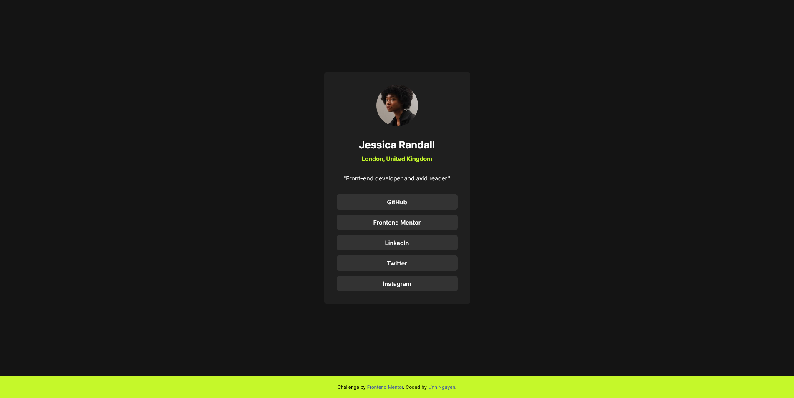

# Frontend Mentor - Social links profile

- [Overview](#overview)
  - [The challenge](#the-challenge)
  - [Screenshot](#screenshot)
  - [Links](#links)
- [My process](#my-process)
  - [Built with](#built-with)
  - [What I learned](#what-i-learned)
  - [Continued development](#continued-development)
- [Author](#author)


## Overview

### The challenge

Users should be able to:

- See hover and focus states for all interactive elements on the page

### Screenshot

_1. Social links profile desktop display_


_2.Social links profile desktop active stage display_


_3.Social links profile mobile display_


### Links

- Solution URL: [Add solution URL here](https://your-solution-url.com)
- Live Site URL: [Add live site URL here](https://your-live-site-url.com)

## My process

### Built with

- Semantic HTML5 markup
- CSS custom properties
- Flexbox

### What I learned

- Building a neat HTML structure and easy to style

```html
<div class="container">
    <div class="card">
      <div class="card-img">
        
      </div>

      <div class="card-header">
        <h4>Jessica Randall</h4>
        <p>London, United Kingdom</p>
      </div>

      <div class="card-body">
        <p>"Front-end developer and avid reader."</p>
      </div>

      <div class="card-footer">
        <a href="#">GitHub</a>
        <a href="#">Frontend Mentor</a>
        <a href="#">LinkedIn</a>
        <a href="#">Twitter</a>
        <a href="#">Instagram</a>
      </div>
    </div>
  </div>
```
> Using Flexbox then add a gap of 30px to seperate eacb div

### Continued development

- Building this card with CSS grid

## Author

- Frontend Mentor - [@yourusername](https://www.frontendmentor.io/profile/auringuyen222)

